

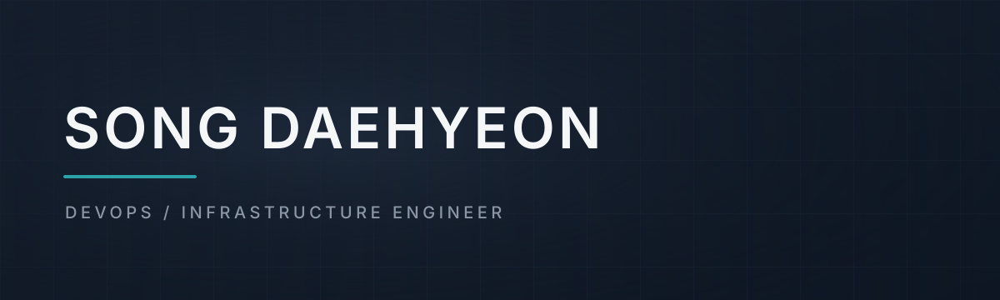

 

 

> 서비스가 안정적으로 동작하는 환경을 설계하고 운영하는 데 관심이 있는 인프라·DevOps 지향 개발자입니다.
>
> 백엔드 구현 경험을 바탕으로 API와 데이터 흐름을 이해하고, 배포·모니터링·운영까지 아우르는 서비스를 만듭니다.

 

## 🙋 About Me

세종대학교 컴퓨터공학과에서 **만든 서비스를 실제 사용자에게 배포하고 끝까지 운영하는 경험**을 쌓아왔습니다.

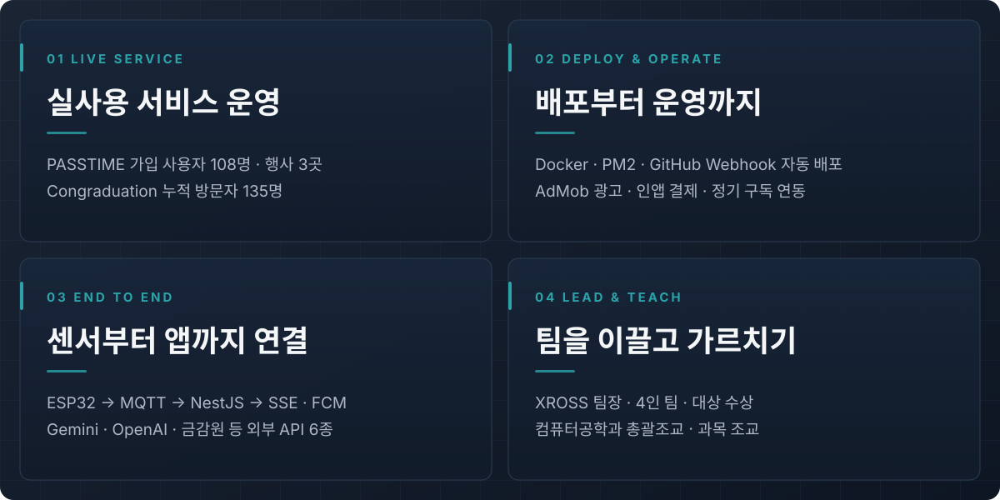

 

## 🏆 Awards

| 대회 | 결과 | 수여 기관 | 일자 |
|:---|:---:|:---|:---:|
| 사물인터넷 혁신융합대학 In-Jeju Challenge | **대상** | 제주특별자치도지사 | 2026.08.06 |
| WITHUS 프로그램 SMART Tournament | **대상** | 사물인터넷 혁신융합대학사업단장 | 2026.07.16 |
| 제21회 창의설계경진대회 | **대상** | 세종대학교 소프트웨어중심대학사업단 | 2026.06.12 |
| 세종대학교 제13회 SW·AI 해커톤 | **은상** | 세종대학교 | 2025.12.24 |
| 세종대학교 제12회 SW·AI 해커톤 | **장려상** | 세종대학교 | 2025.06.26 |

 

## 🧭 Experience

| 연도 | 활동 | 내용 |
|:---:|:---|:---|
| 2026 | SV Excellence in Technology & Operations Program | San Jose State University 해외연수 **수료** |
| 2026 | 세종대학교 컴퓨터공학과 조교 | C++ 과목 조교 · 고급프로그래밍활용 과목 조교 · **총괄조교** |
| 2025 | 세종대학교 컴퓨터공학과 조교 | 기초코딩 과목 실습조교 |
| 2025 | 세종대학교 컴퓨터공학과 학생회 | 사무차장 |
| 2024 | 제주도 국토대장정 | **수료** |
| 2024 | 세종대학교 컴퓨터공학과 학생회 | 사무부장 |
| 2021 | 세종대학교 컴퓨터공학과 학생회 | 민원부 수습 · 1학년 과대표 |

 

## 📌 Projects

| Project | 소개 | 핵심 수치 | 구분 |
|:---|:---|:---|:---:|
| **XROSS** | 무인점포 미결제 탐지 통합 관제 시스템 | 행동 인식 **96.7%** · 교차검증 **95.0%** · 지연 **2.6초** | 캡스톤디자인 |
| **PASSTIME** | 세종대 교내 행사 입장권·참가비 관리 앱 | 사용자 **108명** · 참가 이력 **53건** · 단체 **4곳** | 운영 중 |
| **Congraduation** | 세종대학교 졸업인증 사이트 | 월 로그인 방문자 **110명** · 누적 **135명** | 운영 중 |
| **FinCue** | 소비 분석 기반 금융상품·카드 추천 서비스 | 금융상품 최대 **900건** · 카드 최대 **1,000건** 동기화 | 백엔드 |
| **나만의 냉장고** | 비지도 학습 기반 레시피 추천 앱 | 레시피 **1,132개** · 재료 **1,524개** · 군집 **10개** | 팀 프로젝트 |

 

## 🛠 Tech Stack

| 분야 | 기술 |
|:---:|:---|
| **Infra / DevOps** |        |
| **Backend** |         |
| **Database** |     |
| **AI / Data** |      |
| **Client / IoT** |     |

 

## 🚀 Project Details

### 1. XROSS · Team X-IV

**CCTV 너머, 결제까지 검증하는 무인점포 통합 관제 시스템**

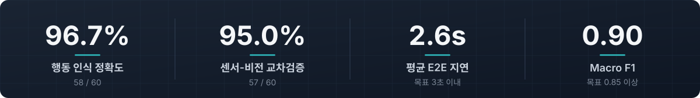

엣지 Vision AI, IoT 무게 센서, POS 결제 데이터를 교차검증해 무인매장에서 **누가 · 무엇을 · 몇 개 · 결제했는가**를 실시간으로 판별합니다.

| 항목 | 내용 |
|:---|:---|
| 과목 · 기간 | 2026-1 세종대학교 캡스톤디자인 · 2026.03.03 ~ 2026.06.19 (16주) |
| 팀 | X-IV (4명) · 협력기업 씨에스리 |
| 내 역할 | **팀장** · POS 연동 · 무게 센서·경고음 IoT · 결제 비교 로직 · 학습 데이터 수집·라벨링 |
| 수상 | 창의설계경진대회 대상 · WITHUS SMART Tournament 대상 · In-Jeju Challenge 대상(도지사상) |

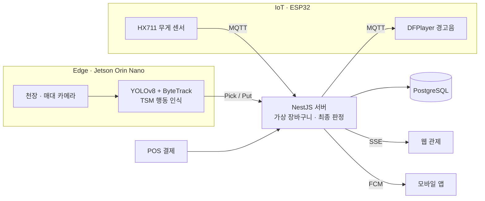

**배경**

- 국내 무인매장 수: 2022년 약 **7,900개** → 2025년 **1만 개 이상**
- 셀프 계산 환경은 미결제·절도 위험이 기존 대비 최대 **3~4배** 높아질 수 있음
- 기존 CCTV는 사후 확인 중심이라 상품 선택과 실제 결제를 실시간으로 대조하기 어려움

**3단계 교차검증**

| 단계 | 입력 | 역할 |
|:---:|:---|:---|
| 1 | Vision AI (천장·매대 카메라) | 고객 ID 추적, Pick / Put / Noise 행동 인식 |
| 2 | IoT 무게 센서 (ESP32 + HX711) | 무게 증감 방향·변화량으로 실제 수량 검증 |
| 3 | POS 결제 데이터 | 가상 장바구니와 결제 내역 비교 후 최종 판정 |

AI는 감지와 후보 생성만 맡고, 최종 미결제 판정은 서버가 센서·결제 데이터를 종합해 결정하도록 책임을 분리했습니다.

이벤트는 `EventDetail(원시)` → `Event(의미)` → `Alert(알림)` 3단계로 저장해 원인 추적과 영상 복기가 가능합니다.

**탐지 시나리오**

| 시나리오 | 판정 이벤트 | 대응 |
|:---|:---|:---|
| 정상 구매 | `PAYMENT_MATCHED` → `EXIT_LINE_CROSSED` | 알림 없음 |
| 결제 불일치 | `PAYMENT_MISMATCH` | 웹·모바일 알림 |
| 미결제 퇴장 | `UNPAID_SUSPICIOUS` | CRITICAL 알림 + 매장 경고음 |
| 장기 체류 | `LONG_STAY` | WARNING 알림 |
| 쓰러짐 | `FALL_DETECTED` | CRITICAL 알림 + 경고음 |

**내가 맡은 부분**

- **IoT**: ESP32 + HX711 무게 센서 → MQTT(HiveMQ Cloud, TLS) JSON 발행, MQTT 수신 → DFPlayer 경고음 재생
- 센서 페이로드를 방향값(-1/+1)에서 **절대 무게값(JSON)**으로 정규화해 단위중량 기반 수량 계산을 일관되게 처리
- **POS 연동**: POS 목업 웹 구현, POS 구역 체류 고객과 trackingKey를 매핑해 결제 주체 식별
- **결제 비교 로직**: 장바구니와 결제 항목을 SKU·수량 기준으로 비교해 결제 불일치와 미결제 퇴장을 분리 판정
- 행동 영상 수집·라벨링, 팀장으로서 일정 관리·통합 테스트·시연 총괄

<b>성능 지표 · 기술 스택 상세</b>

 

| 지표 (시연 환경) | 목표 | 결과 |
|:---|:---:|:---:|
| Pick / Put / Noise 행동 인식 정확도 | 90% 이상 | **96.7%** (58/60) |
| Macro F1 | 0.85 이상 | **0.90** |
| 센서-비전 교차검증 통과율 | 90% 이상 | **95.0%** (57/60) |
| E2E 지연 (센서 → 서버) | 3초 이내 | 평균 **2.6초** |
| 요구사항 종합 이행률 | - | **97 / 100** |

| 계층 | 기술 |
|:---|:---|
| Edge AI | Jetson Orin Nano · YOLOv8 + ByteTrack · TSM / ResNet50 · TensorRT FP16 · OpenCV |
| IoT | ESP32 · HX711 로드셀 · DFPlayer Mini · MQTT (HiveMQ Cloud) |
| Backend | NestJS 11 · TypeScript · Prisma · PostgreSQL · JWT / Passport · Swagger · SSE · FCM |
| Frontend | React 19 · Vite · Tailwind CSS 4 · TanStack Query · Zustand · Turborepo · React Native |
| Streaming · POS | WebRTC 실시간 CCTV · React + Vite POS 목업 |

🔗 [xross-ai](https://github.com/SEJONG-XROSS/xross-ai) · [xross-frontend](https://github.com/SEJONG-XROSS/xross-frontend) · [xross-pos](https://github.com/SEJONG-XROSS/xross-pos)

 

### 2. PASSTIME

**세종대학교 교내 행사 입장권·참가비 관리 앱**

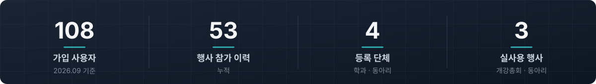

교내 행사의 입장권 발급과 참가비 납부·환불을 수기로 처리하며 생기던 누락과 지연을 줄이기 위해 만든 서비스입니다.

세종대 SSO 로그인부터 NFC 입장, 납부 증빙 AI 검토, 푸시 알림, 배포 자동화까지 한 흐름으로 운영하고 있습니다.

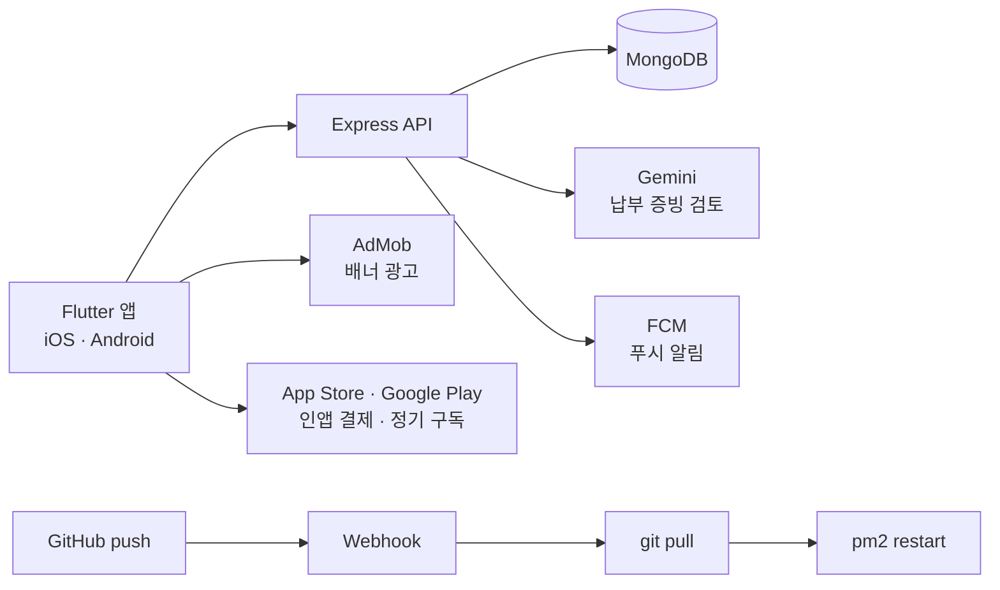

**실사용 행사** (2026.09 기준)

- 세종대학교 컴퓨터공학과 개강총회
- 세종대학교 ALOM 중앙개발동아리
- 세종대학교 회화과 개강총회

**Role — Backend Developer**

- 세종대 SSO + JWT(쿠키) 인증, 역할 기반 권한 (member / executive / leader / ROOT)
- 행사 코드 · **NFC(NDEF) 태그**로 입장권 등록 및 상태 관리
- **Gemini** 기반 참가비 납부 증빙 이미지 AI 검토로 관리자 승인 보조
- 납부·환불 처리, **FCM** 푸시 알림, **node-cron** 리마인더와 만료 데이터 자동 정리
- **Docker + PM2** 운영, GitHub Webhook으로 `git pull` → `pm2 restart` 자동 배포

**앱 수익화 — 광고 · 결제 · 구독 실연동**

- **Google AdMob 광고**: 설정 화면 배너 광고, Android · iOS 광고 단위 분리, 로드 실패 시 광고 영역 자동 숨김
- **인앱 결제**: `in_app_purchase`로 App Store · Google Play 스토어 결제 연동, 일시불 후원(소비성 상품) 구현
- **정기 구독**: 월간 구독 상품 연동, 결제 상태(대기 · 완료 · 복원 · 취소 · 오류)별 처리와 구매 확정(`completePurchase`)

<b>기술 스택 · 지표 상세</b>

 

| 지표 | 수치 |
|:---|:---:|
| 가입 사용자 | 108명 |
| 행사 참가 이력 | 53건 |
| 등록 단체 | 4곳 |
| 단체 가입 요청 | 2건 |

| 구분 | 기술 |
|:---|:---|
| Backend | Node.js · Express · MongoDB / Mongoose · JWT · Multer · node-cron · Firebase Admin · Gemini API |
| Infra | Docker · PM2 · GitHub Webhook |
| App | Flutter (iOS / Android) · NFC · FCM |
| Monetization | Google AdMob (`google_mobile_ads`) · In-App Purchase (`in_app_purchase`) · 월간 정기 구독 |

🔗 [iOS 다운로드](https://buly.kr/2qb9qIM) · [Android 다운로드](https://buly.kr/1n6bxAk) · [Server](https://github.com/SEJONG-PASSTIME/PASSTIME_Server) · [Android](https://github.com/SEJONG-PASSTIME/PASSTIME_Android) · [iOS](https://github.com/SEJONG-PASSTIME/PASSTIME_iOS)

 

### 3. Congraduation

**세종대학교 졸업인증 사이트**

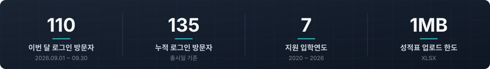

졸업요건과 공학인증(ABEEK) 충족 여부를 학생이 직접 계산하기 어렵다는 문제에서 출발했습니다.

기이수성적 엑셀을 업로드하면 영역별 이수 현황, 부족 학점, 공학인증 충족 여부, 이수체계도, 학기별 시뮬레이션을 한 화면에서 확인할 수 있습니다.

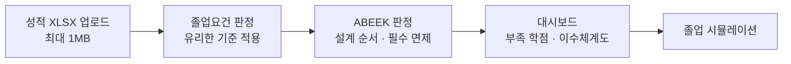

**주요 기능**

- 입학연도·졸업연도 기준 중 **학생에게 유리한 요건**을 자동 적용
- ABEEK 공학인증: 설계 과목 이수 순서, 신설 필수과목 면제, 소수점 학점 처리
- 학과 코드 매핑 기반 학과별 요건 판정, scrape / OCR 기반 요건 데이터 수집

<b>기술 스택 상세</b>

 

| 구분 | 기술 |
|:---|:---|
| Backend | Java 17 · Spring Boot 3.5 · Spring Data JPA · H2 · Validation · springdoc(Swagger) · JWT |
| Frontend | React 19 · TypeScript · Vite · React Router 7 · Tailwind CSS 4 |
| Infra | Vercel |

🔗 [서비스 바로가기](https://congraduation-frontend.vercel.app) · [Frontend](https://github.com/congraduation-team/congraduation-frontend) · [Backend](https://github.com/congraduation-team/congraduation-backend)

 

### 4. FinCue

**소비 분석 기반 금융상품·카드 추천 서비스**

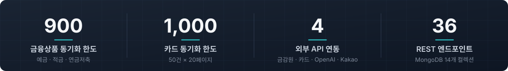

사용자의 수입·지출을 분석해 **소비 패턴에 맞는 적금·카드를 추천**하고, 실제 소비 데이터를 근거로 답하는 LLM 금융 챗봇을 제공합니다.

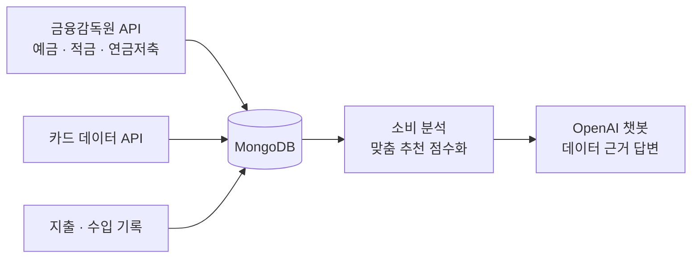

**사용한 API**

| API | 용도 |
|:---|:---|
| 금융감독원 금융상품통합비교공시 API | 정기예금 · 적금 · 연금저축 금리·기간·한도 수집 (종류별 최대 300건) |
| 카드고릴라 카드 데이터 | 카드명·연회비·전월실적·혜택 분야 수집 (최대 1,000건) |
| OpenAI Chat Completions API | 소비·수입 요약을 프롬프트에 주입한 맞춤 금융 챗봇 |
| Kakao OAuth2 로그인 | 카카오 토큰으로 사용자 조회 후 JWT 발급 |

**주요 기능**

- **소비 분석**: 월별 요약, 카테고리별 비율, 전월 대비 비교, 최근 12개월 추이, 일별 캘린더
- **맞춤 추천**: 최근 3개월 최다 지출 카테고리와 카드 혜택 분야를 매칭하고, 적금 금리와 함께 점수화해 추천
- **LLM 챗봇**: 질문 의도(추천·챌린지·커뮤니티)별로 필요한 데이터만 추가하고, 데이터에 있는 값만 인용하도록 규칙화
- **절약 챌린지·배지**, 커뮤니티 게시글·댓글·좋아요·북마크

<b>기술 스택 상세</b>

 

| 구분 | 기술 |
|:---|:---|
| Backend | Java 17 · Spring Boot 3.5.7 · Spring Security · OAuth2 Client · JWT · RestTemplate · springdoc(Swagger) |
| Database | MongoDB (Spring Data MongoDB) · H2 |
| External API | 금융감독원 finlife API · 카드 데이터 API · OpenAI API · Kakao API |

 

### 5. 나만의 냉장고

**비지도 학습 기반 레시피 추천 앱**

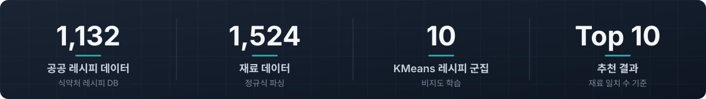

냉장고에 있는 재료로 무엇을 만들지 고민하는 문제에서 출발했습니다.

식품의약품안전처 공공 레시피 데이터를 정제하고, **정답 라벨 없이 재료 구성만으로 레시피를 군집화(비지도 학습)**해 보유 재료와 비슷한 레시피를 추천합니다.

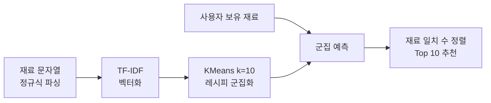

**AI 추천 파이프라인**

1. `RCP_PARTS_DTLS`(재료 문자열)를 정규식으로 파싱해 재료명만 추출·중복 제거
2. **TF-IDF**로 레시피별 재료 텍스트를 벡터화
3. **KMeans(k=10)**로 전체 레시피를 재료 구성이 비슷한 10개 군집으로 학습
4. 사용자 보유 재료를 같은 벡터 공간으로 변환해 속한 군집 예측
5. 군집 내 레시피를 **재료 일치 수**로 정렬해 상위 10개 반환

**사용한 API**

| API | 용도 |
|:---|:---|
| 식품안전나라 조리식품 레시피 DB (식약처 공공데이터) | 레시피명·재료·조리 단계(최대 20단계)·영양정보 5종·저감 조리 팁 |
| Kakao 로그인 API | 카카오 액세스 토큰으로 사용자 조회 후 자체 JWT 발급 |
| 자체 Flask 추천 API (`/recommend`, `/details/{id}`) | Spring Boot가 WebClient로 호출해 추천 결과를 앱에 전달 |

<b>기술 스택 상세</b>

 

| 구분 | 기술 |
|:---|:---|
| AI | Python · Flask · pandas · scikit-learn (TF-IDF, KMeans) |
| Backend | Java 17 · Spring Boot 3.5 · Spring Security · JPA · MySQL · JWT · WebClient · OpenCSV · springdoc |
| App | Flutter · Kakao 로그인 SDK |

🔗 [Backend](https://github.com/SSONGDH/My_Own_Refrigerator_Backend) · [AI](https://github.com/SSONGDH/My_Own_Refrigerator_AI)

 

## 📜 Certifications

| 자격증 | 취득 |
|:---|:---:|
| SQLD | 2026 |
| 정보처리기능사 | 2023 |
| 네트워크관리사 2급 | 2021 |
| 인명구조요원 | 2021 |
